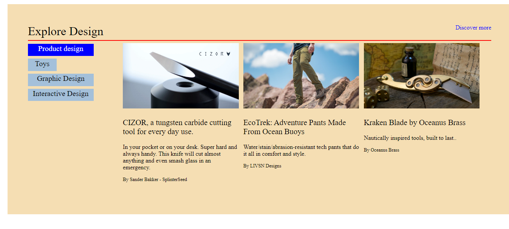

# Kickstarter clone

## Introduction

*Kickstarter is a crowdfunding platform which helps to bring creative projects to life.* 

<!--  -->

### Design and Tech Page

## Creator Stories 

## Tags
* Marquee
* Select-Option
* Link-rel="icon"

## Pseudo-classes
* Hover 

 

## Properties
* Opacity
* Brightness
* Cursor
* Position

## Layouts
* Grid
* Flex

## JS
* set Timeout()
* addEventListener()
* remove()

### Most important part is that we have learnt during our project is communicating and collaborating well with the team members is key to a successful project.

